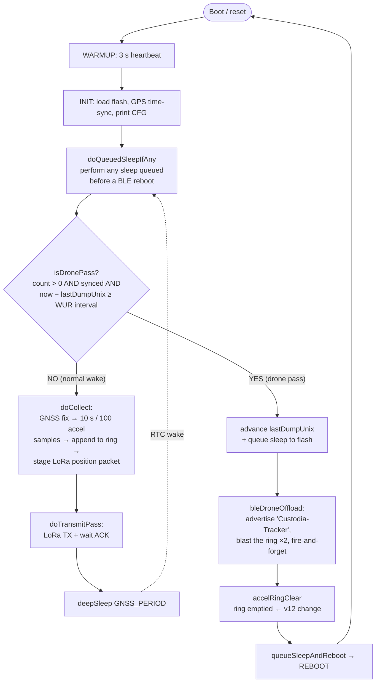

# ISL Board — Production firmware v12 (COLLAR, new-data-per-pass offload)

**v12 = v11 with exactly one behavioural change: every drone pass transmits ONLY
NEW accelerometer data.** Everything else — the proven, no-freeze `api.ble.uart`
fire-and-forget transport, the short single-notification wire format, the x2 blast,
GNSS A/B/C, LoRa, 34 µA sleep, the accel flash ring, WUR/`SIMULATE_WUR`,
reboot-to-sleep — is **identical to v11** (the last successful / bench-verified build,
see `../v11/`).

---

## How v12 actually works (traced from the source, verified against `logs/`)

### The one-action-per-wake loop

The firmware is a **state machine that does exactly ONE thing per wake**, then goes
back to sleep. After the one-time `WARMUP` (3 s heartbeat) and `INIT` (load flash,
GPS time-sync, print `[CFG]`), every wake runs the `OPERATE` body once:

1. **`doQueuedSleepIfAny()`** — if the *previous* iteration was a drone pass, it
   rebooted after queueing a sleep to flash; this performs that sleep now, in a fresh
   **BLE-clean** session (this is how BLE is guaranteed torn down without touching the
   deep-sleep floor).
2. **`isDronePass()`?** True only when **(a)** there is accel data to send
   (`count > 0`), **(b)** the clock is synced, and **(c)** it has been ≥ the
   `SIMULATE_WUR_HOURS` interval since the last dump (or, in real mode, the AS3933
   `WAKE` pin is HIGH).
   - **YES → DRONE PASS:** advance `lastDumpUnix`, **pre-arm a queued sleep to flash**
     (crash recovery), **`bleDroneOffload()`** (advertise + blast the ring x2,
     fire-and-forget), **`accelRingClear()`** (v12: empty the ring), then
     **`queueSleepAndReboot()`** which **reboots** (the reboot is what deterministically
     clears BLE). *A drone-pass wake does NOT collect or transmit LoRa — it only
     offloads, then reboots.*
   - **NO → normal cycle:** `doCollect()` (GNSS fix → **collect 10 s / 100 accel
     samples → append to the flash ring** → stage the LoRa position packet),
     `doTransmitPass()` (LoRa TX + wait for ACK), then `deepSleep(GNSS_PERIOD)`.



### Two independent sequence spaces (don't confuse them)

- **LoRa packet seq** (`nextSeq`/`delivered`) — the position packet counter. In the run:
  `87, 88, 89 …` monotonic.
- **Accel ring seq** (`accelMeta.nextSeq`) — a *separate* counter stamped on each 10 s
  accel record. In the run: `82, 83, 84 …`. **This is the seq the drone dedups on.**
  The two are never cross-mapped over the air (relevant to v13 — see below).

### The ring, and why each pass is "new data"

`doCollect()` appends one 100-sample record per fix to a **16-slot flash ring**
(`accelRingAppend`). On a drone pass v12 blasts whatever is in the ring, then
`accelRingClear()` sets `count = 0`. So the **next** pass can only contain records
appended *after* this pass → every pass is a fresh, non-overlapping batch.

### Cross-check against the actual logs (`logs/`)

| Step in the flow | Collar log (`Tracker_v12_run1.txt`) | Receiver log |
|---|---|---|
| WARMUP → INIT | `v12 boot … [alive]…`, `[FLASH] Loaded: nextSeq=87`, time-sync, `[CFG]…` (L1–42) | `Scanning for 'Custodia-Tracker'` |
| Normal wake → collect + accel + LoRa | `COLLECT…`, `[RING] stored seq=82 … (16/16)`, `[TX] seq=87 … [RX] ACK OK` (L43–56) | — |
| deep sleep | `IDLE deep-sleep 180 s` → `[WAKE]` (L57–60) | — |
| **Drone pass** (1st, leftover ring) | `DRONE PASS: offloading 16 records` → blast → `[RING] cleared (delivered)` → reboot (L61–68) | `announcing 16 records`, 16× `OK`, `END … new=16 dup=0 bad=0`, then a 2nd blast all `dup` (`new=16 dup=16`) |
| Reboot → queued sleep (BLE-clean) | `BOOT: performing queued 180 s deep-sleep` (L84–88) | — |
| **Later passes = NEW data only** | `offloading 1 records`, then `offloading 2 records`, `2`, `2 …` (never a re-send) | `new=17` (+1), `new=19` (+2), `21`, `23 … 35`; **`bad=0` throughout, no cross-pass dup** |

**Conclusion: the code does exactly what this document says, and the logs confirm it.**
Across ~13 passes: **35 unique records received, 0 bad, 0 corrupt**, the only `dup`
is each pass's own 2nd (redundancy) blast, and the collar never froze. (Two cosmetic
capture artifacts — duplicated serial segments on the collar, a few dropped *printed*
lines on the receiver — are explained in `logs/ANALYSIS.md`; neither is a firmware
fault, and flash `nextSeq` stays monotonic through both.)

## ✅ Bench result — 2026-07-28 (`logs/`)

Verified over ~1.5 h, `SIMULATE_FIX=1`, period 3 min, drone pass ≈ every 9–10 min:

- **Each pass sent only NEW records** — first pass flushed the 16 leftover from the
  prior v11 run, then every pass was **1, 2, 2, 2 …**, never a re-send. ✅
- Receiver validated **new = 35, bad = 0, corrupt = 0**; **no cross-pass dup** (the
  only `dup` is the in-pass 2nd blast). ✅
- Collar **never froze** (~13 passes, all reboot-to-sleep clean); LoRa 100 %. ✅
- **Bonus:** a 2-record pass is only **~9 s** of BLE air-time (vs v11's always-16 ≈
  72 s) — much friendlier to a real, brief fly-by.

Cosmetic only (not firmware): some duplicated serial segments in the collar log (flash
`nextSeq` is monotonic, so the firmware is fine) and a few dropped *printed* lines on
the receiver (the END counters still read `new=16`/`bad=0`, so the data was received).
Power: the PPK ran the full 102 min without freezing, but USB was connected so "sleep"
reads the ~1.9 mA USB-CDC artifact, **not** the 34 µA floor — measure battery-only,
headless for a real number. Full write-up in `logs/ANALYSIS.md`.

## What v13 should add (recommendation)

**Restore the per-record TIMESTAMP to the BLE offload.** Each accel record already
stores a `ts` (`[RING] stored seq=82 ts=1784059200 n=100`), but the v11/v12 header
`R <seq> <n> <ck16>` drops it (it was removed to keep every line ≤ 20 B). So the drone
gets motion bursts ordered by `seq` but with **no absolute time** — and for behaviour
science each 10 s burst needs to be time-referenced. Fix without breaking the
one-notification rule: send `ts` as its **own short line** right after the header, e.g.
```
R <seq> <n> <ck16>
T <ts>
<x>,<y>,<z> × n
```
`T 1784059200` is 12 B — one notification. Everything else stays exactly as the proven
v12. (Secondary v13 ideas: make `BLE_LINE_GAP_MS` a touch faster to shrink the window;
add the real-WUR fast-path when the LF transmitter arrives.)

## The one change: clear-after-send

| | v11 (`OFFLOAD_DELETE_AFTER_SEND = 0`) | **v12 (`= 1`)** |
|---|---|---|
| After a blast | **keeps** the ring | **clears** the ring |
| A drone pass carries | the **whole ring** (old + new) | **only records collected since the last pass** |
| Receiver sees across passes | already-sent records as `dup` | **all-new `seq`s, never a cross-pass dup** |
| Missed pass | nothing lost (re-sent next pass, drone dedups) | **those records are gone** (no retention) |

So in v12 each transmission is a **fresh, non-overlapping batch** — new accelerometer
data every time, exactly as requested.

### Why the retention is intentionally dropped

Fire-and-forget has **no ACK**, so the collar cannot know whether a pass was actually
received; clearing after send therefore *can* lose data if a pass is missed. That is
**by design for v12**: on-collar buffering/replay is being handed to the **other
engineer**, who will own retention (buffer all accel data, release it when called)
with a **different BLE approach**. v12's only job is "each transmission is new data."

To get v11's never-lose behaviour back, set `OFFLOAD_DELETE_AFTER_SEND` to `0`.

## Everything else (unchanged from v11 — for reference)

- **Transport:** RUI3 `api.ble.uart`, fire-and-forget. Advertise by NAME
  `Custodia-Tracker`, fixed `BLE_SETTLE_MS` wait, `api.ble.uart.write()` each line
  paced `BLE_LINE_GAP_MS`, hold, **reboot-to-sleep** clears BLE (never
  `api.ble.stop()`). The whole stage is a bounded sum of delays → **the collar can
  never freeze in BLE.**
- **Wire format (every line ≤ 20 B = one NUS notification):**
  ```
  I <dev> <nrecs>          announce (DEVICE_ID once)
  R <seq> <n> <ck16>       per-record header (seq, sample-count, 16-bit checksum)
  <x>,<y>,<z>              a sample
  E <dev> <nrecs>          end
  ```
  Blasted `BLE_BLAST_REPEATS` (=2) times per pass for loss resilience; the receiver
  dedups the in-pass repeat by `seq`.
- **`Pairing procedure fail`** on the collar is cosmetic on this RUI3 build —
  notifications flow unencrypted and validated perfectly in the v11 run.

## Config knobs (top of `ISL_Production_v12.ino`)

| Knob | Default | Meaning |
|------|---------|---------|
| `OFFLOAD_DELETE_AFTER_SEND` | **1** | **1 = v12: clear ring after each blast (new data every pass).** 0 = v11: keep + drone dedups. |
| `DEVICE_ID` | 51 | Collar id, sent in the `I`/`E` lines (`051`). |
| `BLE_BLAST_REPEATS` | 2 | How many times the batch is sent per pass (loss resilience). |
| `BLE_SETTLE_MS` | 6000 | Fixed wait for the central to connect+subscribe before streaming. |
| `BLE_LINE_GAP_MS` | 22 | Per-line pacing (≥ conn interval). Lower it to shorten the fly-by window. |
| `BLE_STREAM_MAX_MS` | 90000 | Safety cap on the whole blast (pure delay-bounded; can't hang). |
| `SIMULATE_WUR_HOURS` | 0.25 | >0 = fake a drone pass every N h; 0 = real AS3933 WUR (P1.04). |
| `GNSS_PERIOD_MIN` | 120 | Deep-sleep between fixes (set small for bench). |
| `SIMULATE_FIX` | 0 | 1 = fabricate fixes to run indoors. |
| `ACCEL_RING_RECORDS` | 16 | Flash ring capacity (holds new records between passes). |

Fast bench recipe: `SIMULATE_FIX 1`, `GNSS_PERIOD_MIN 2`, `SIMULATE_WUR_HOURS 0.1`.

## What to check on the bench

1. Collar boots `PRODUCTION v12`, and between passes collects
   `[ACCEL] 100 samples → [RING] stored` (a few new records per pass window).
2. On a drone pass the receiver validates a batch of records, all reading
   `OK (100 samples, checksum match)`, ending `END … bad=0`.
3. **Across passes the seqs are all new** — no cross-pass `dup`. The only `dup` is the
   in-pass 2nd blast (`BLE_BLAST_REPEATS`). This is the v12 signature.
4. Collar always leaves the BLE stage on time and reboots-to-sleep. **Never freezes.**

> Sanity note: if a pass fires with **no** new records collected since the last one
> (e.g. `SIMULATE_WUR_HOURS` shorter than `GNSS_PERIOD_MIN`), the collar announces
> `0 records` and sends an empty batch — correct behaviour (there was no new data).

## Known / deferred (unchanged)

- **Real AS3933 WUR wake** pending the LF transmitter; `SIMULATE_WUR` stands in.
- **Accel module sleep current** (~296 µA on 3V3) — hardware switchable rail on the
  next PCB (`ACCEL_PWR_PIN` hook ready).
- **On-collar retention/replay** — intentionally not in v12; owned by the other
  engineer's BLE approach.
