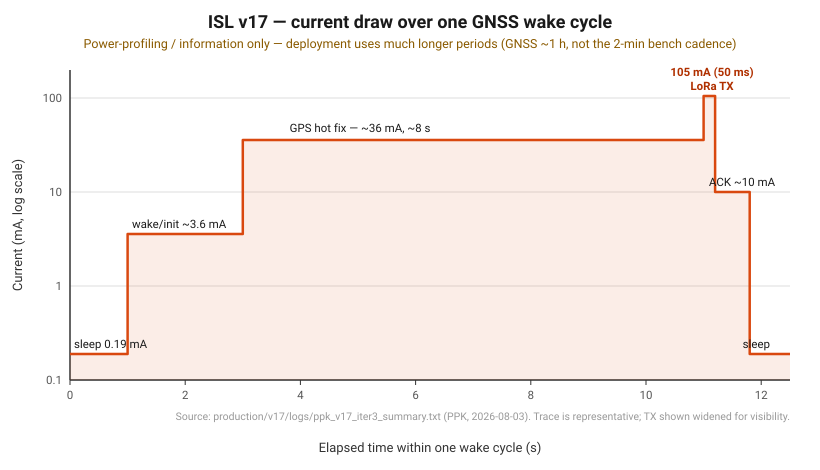
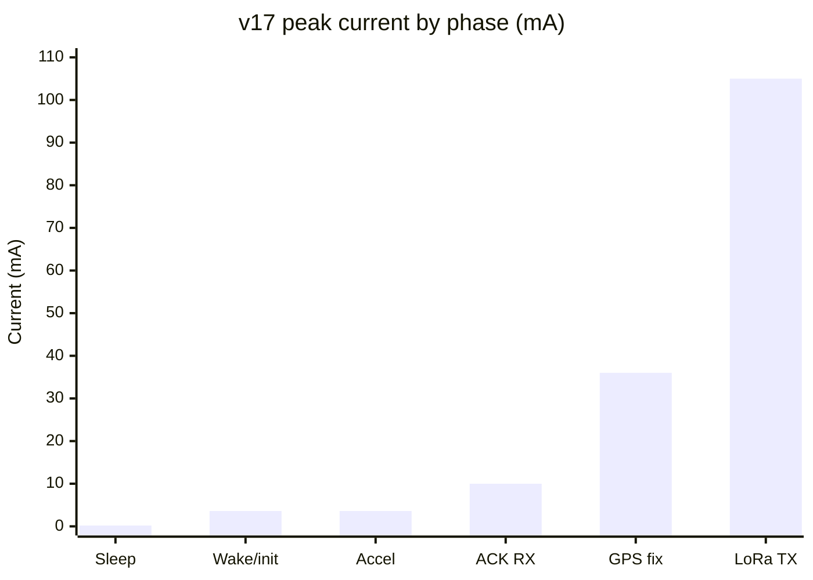
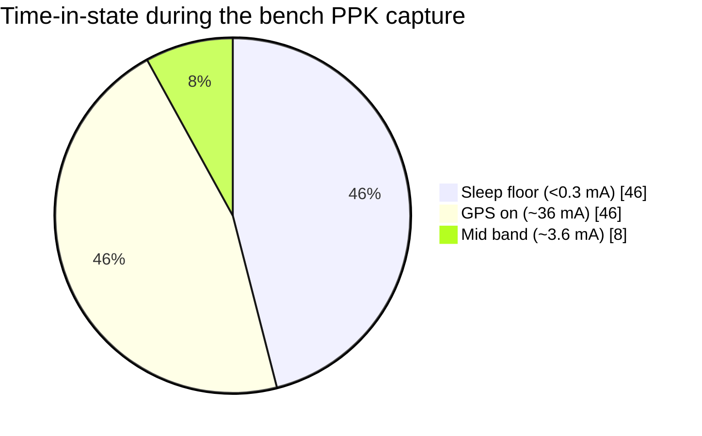

# ISL v17 — Power Profiling

> ⚠️ **For power-profiling / information purposes only.** These numbers come from a
> bench PPK capture that ran an accelerated cadence (**GNSS every ~2 min**, lots of
> indoor GPS-on time) so every phase would appear in a short window. **The real
> deployment runs with much longer, different periods** (GNSS ~1 h, accelerometer ~3 h,
> BLE offload ~every 2 weeks), so the *mean* current here is **not** a deployment
> number — the per-phase currents are what to read from this. Source data:
> [`logs/ppk_v17_iter3_summary.txt`](logs/ppk_v17_iter3_summary.txt) (PPK
> `ppk20260803T143349`, 34.3 min, 10 ms samples).

## Per-phase power table

| Phase | Current | Duration (per occurrence) | Energy / occurrence | Deployment cadence | Notes |
|---|---|---|---|---|---|
| **Deep-sleep floor** | **~0.19 mA** (190 µA, median 196 µA) | continuous between wakes | dominates by *time*, not amplitude | always | iteration3 floor; fixable to ~0.035–0.045 mA (v17 opt #1 — P1 input-buffer crowbar) |
| Wake + init | ~3.6 mA | ~1–2 s | ~0.002 mAh | each wake | alive-first boot + peripheral init |
| **GPS hot fix** | **~36 mA** (25–45 mA band) | ~8 s (hot) | **~0.08 mAh** | ~1 h | the dominant active cost; cold fixes (180 s) cost far more — keep the cell charged |
| **LoRa TX** (packet) | **~105 mA** (peak) | ~50 ms | ~0.0015 mAh | each fix | short high-amplitude burst |
| LoRa ACK RX | ~10 mA | <1 s | ~0.001 mAh | each fix | receiver ACK for the delivery guarantee |
| Accelerometer collect | ~3.6 mA | ~10 s (100 samples) | ~0.01 mAh | ~3 h | onboard LIS3DHTR over SPI |
| BLE offload (drone pass) | ~3.6 mA band | ~120 s / pass | ~0.12 mAh | ~2 weeks | ring drained to the drone; rare event |

*(Energy = current × time; `mAh = mA × s ÷ 3600`.)*

## Graph — current over one GNSS wake cycle

*Representative single wake cycle (log current axis). The board sleeps at ~0.19 mA,
wakes to ~3.6 mA, powers the GPS for a ~8 s hot fix at ~36 mA, fires a ~50 ms LoRa TX
burst at ~105 mA, receives the ACK, then returns to the sleep floor. Accelerometer and
BLE passes (not shown) occur on their own, much slower timers.*

If the SVG above does not render in your viewer, the same magnitudes are shown here:

## Duty split of the profiling capture (bench cadence — *not* deployment)

Because the capture forced GNSS every ~2 min with lots of indoor no-fix GPS-on time,
GPS-on dominated its timeline:

At the **real** deployment cadence (GNSS ~1 h) the sleep floor instead dominates the
timeline, which is why the floor is the single biggest lever on battery life.

## Lifespan model (informational)

Modelled on a **9600 mAh LiSOCl₂** cell at the deployment cadence (GNSS/1 h, accel/3 h,
BLE/2 wk), assuming **hot** ~8 s fixes:

| Case | Budget | Life (85 % usable) |
|---|---|---|
| **As-is** (floor ~190 µA) | ~6.8 mAh/day | **~3.3 years** |
| **Floor fixed** (~40 µA, opt #1) | ~3.2 mAh/day | **~7 years** |

**Biggest sensitivity — GPS hot vs cold:** the table assumes hot fixes. If the L76K
backup cell can't hold ephemeris across the 1 h gap and fixes go cold (180 s charge),
GPS energy dominates: **10 % cold ⇒ ~2 yr, 25 % ⇒ ~1.3 yr, 50 % ⇒ ~0.8 yr.** The v15
charge-on-cold strategy is what keeps fixes hot.

---
See [`README.md`](README.md) → *Power & lifespan* and *Pending optimizations*, and
[`../../docs/ROADMAP.md`](../../docs/ROADMAP.md) §6 for the deep-sleep floor detail.
